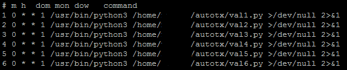
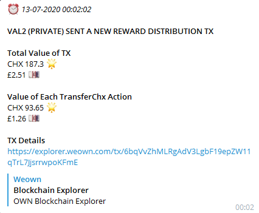

# WeOwnValidatorPayoutTool

## Tool Description

A Python script to automate TransferChx actions on the WeOwn Public Blockchain.

The primary use case for the script is to automate the composure, submission and notification of transactions which contain TransferChx actions sent from a validator wallet to one or more beneficiary wallets.

It can be combined with crontab or any other scheduling tools capable of executing python code to provide an end-to-end private CHX validator reward distribution service.

It uses:
* OwnBlockchainSdkPython (https://github.com/OwnMarket/OwnBlockchainSdkPython)
* Python Requests Library to handle WeOwn node api endpoint http requests (https://requests.readthedocs.io/en/master/)
* CoinGecko API to provide a conversion from CHX to a local currency (https://www.coingecko.com/api/documentations/v3)
* Telegram Bot API to send messages with details of the automated transaction to a specified chatID which requires an existing or newly created bot (https://core.telegram.org/bots/api) (https://core.telegram.org/bots#creating-a-new-bot)

## Stages of the Script

There are six stages:

0. Setup variables: define the WeOwn node api endpoint url, validator wallet details & CHX reward beneficiaries' wallet details

1. Retrieve information about the validator wallet using the WeOwn node api endpoint

2. Import the validator wallet using private key, compose, sign & prepare the Tx for submission

3. Submit the signed Tx using the WeOwn node api endpoint, receive the txHash from the json response

4. Prepare telegram message variables: get current date & time, get local currency rate, calculate conversion of CHX amount to local currency value

5. Define a telegram message function, send a message to the specified chatID with the Tx details including a link to the official WeOwn Blockchain Explorer

## Script Installation, Configuration & Cloning

### Installation

```
$ git clone https://github.com/Muncan90/WeOwnBlockchainTools.git
```

```
$ cd WeOwnBlockchainTools/WeOwnValidatorPayoutTool/
```

```
$ pip3 install -r requirements.txt
```

### Configuration

Create a dedicated directory e.g. `$ mkdir /home/<user>/autotx` replacing `<user>` as required. This is the directory used to store your specifically tailored script(s) which are configured in the next steps..

```
$ nano WeOwnValidatorPayoutTool.py
```

To prepare the script for cloning make changes to the following lines in `WeOwnValidatorPayoutTool.py` to suit your own requirements:

**Line 14**

```
node_api_url = 'https://wallet-node.mainnet.weown.com'
```

This can be left as is, if you are running your own node api endpoint you should adjust this variable to suit your own environment

___

**Line 17**

```
validator_wallet_addr = 'CHa52gXkAcfZ8RNnuTszdE3XvxaNhtrdFrM'
```
Change this to suit your own requirements, this is the validator wallet from which you distribute CHX on schedule

___

**Line 18**

```
validator_wallet_pvt_key = '48wM487Ti6XGJW1oHopFfLiUKb5FLgArPTrZCcS4QHF3'
```

The private key for the validator wallet address specified in Line 17

___

**Line 21+**

```
beneficiary1_wallet_addr = 'CHfree5ZSwDwKRh2btFG4UPGSwtSZxyqPeQ'
```

The wallet address of the first beneficiary, add or remove these variables based on your requirements, **REMEMBER** to ensure that this aligns with both Line 51 & 62+

___

**Line 51**

```
chx_distribution = round(available_balance/2, 7)
```

The amount in CHX to distribute to each beneficiary wallet, in this case we are dividing the validator wallet's available balance by `2` then rounding that figure to `7` decimal points to ensure the Tx is not rejected. Change `2` to suit your needs but never change `7`

___

**Line 62+**

```
tx.add_transfer_chx_action(beneficiary1_wallet_addr, chx_distribution)
```

The action to distribute CHX to the wallet address of the first beneficiary, add or remove these variables based on your requirements, **REMEMBER** to ensure that this aligns with both Line 51 & 21+

___

**Line 99**

```
cg_chx_local_rate = cg_chx_local_rate_response_json["chainium"]["gbp"]
```

Defining the local rate that should be used to calculate the local currency value of the CHX Tx, change `gbp` to suit your requirements but never change `chainium`

___

**Line 115**

```
bot_token = 'TG_BOT_API_TOKEN'
```

Provide your own telegram bot api token e.g. `110201543:AAHdqTcvCH1vGWJxfSeofSAs0K5PALDsaw`

___

**Line 116**

```
bot_chatID = 'TG_CHAT_ID'
```

Provide your own telegram chatID that the bot will use to send messages e.g. `-3948506920`

___

**Line 124-129**

```
my_message0 = "_⏰ {}_".format(dtn_ftime) + "\n\n" + "*VALIDATOR NAME SENT A NEW REWARD DISTRIBUTION Tx*\n\n"
```

Change these lines to suit your own requirements, remove or add `my_messagen` variables as required and remember to update the `my_message_final` variable to capture all `my_messagen` variables when finished

___

Save a copy of the script with a name that makes sense to you for future management e.g. `auto_tx_MASTER_TEMPLATE.py` in the dedicated directory you created earlier e.g. `/home/<user>/autotx` this can be used to create clone scripts for as many validator wallets as you wish to automate transactions for.

### Cloning

Open the script template

```
$ nano auto_tx_MASTER_TEMPLATE.py
```

Amend the required variables to suit the required validator wallet, save a copy with a naming convention that aligns with your validator deployment e.g. `val1.py` in the dedicated directory you created earlier e.g. `/home/<user>/autotx`

Repeat this step until all required scripts have been created and saved in the dedicated directory

### Testing

Manually test the script(s) to ensure functionality:

```
$ cd /home/<user>/autotx

$ python3 val1.py
$ python3 val2.py
$ ...

```


## Adding Cron Tasks

When you are satisfied the scripts are functioning as expected, you can use crontab to automate the python script execution on a schedule of your choice. This provides an end-to-end private CHX validator reward distribution service.

Crontab Generator provides an easy-to-configure interface which outputs crontab lines (https://crontab-generator.org/)

The "Command to Execute" is `/usr/bin/python3 /home/<user>/autotx/val1.py` replacing `<user>` as required.

To add a cron job run `$ crontab -u <user> -e` replacing `<user>` as required then paste in each crontab line provided by Crontab Generator

The example screen shot below shows 6 cron jobs configured to execute between 00:01-00:06 on the first day of the week (Weekly)



## Telegram Message Sample



## To Do & Improvements

* Implement proper http response error handling

___

Support of development by means of TransferChx action is always appreciated | tip-jar: `CHPwxUTVsdHJHv6zQuyU6ZZYis9Sp1u2x6P`